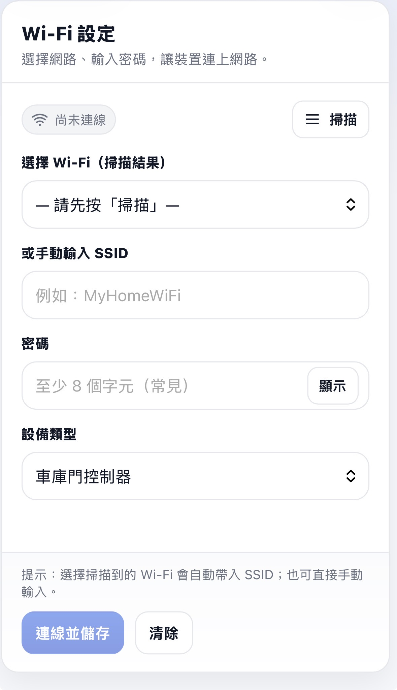
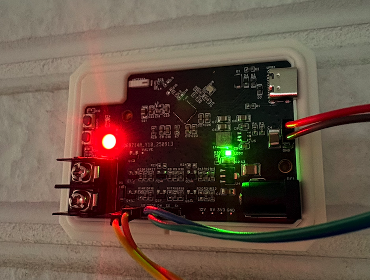

# HomeKit Garage Door Opener

ESP32C3-based Apple HomeKit garage door controller using ESP-IDF and FreeRTOS.

---

## Overview

This project implements a HomeKit-compatible garage door opener built on ESP32C3.

---

## Features

- Apple HomeKit accessory support
- WiFi provisioning via SoftAP
- FreeRTOS task-based architecture
- NVS-based configuration storage

---

## Build

```bash
idf.py build
idf.py flash
```
---

## HomeKit Setup & Pairing Guide

Follow the steps below to configure and pair the device with Apple Home.

1. Power on the device & Connect to the Device Access Point .

   On your phone or computer, connect to the Wi-Fi network:
   
	 - SSID: HOMEKIT_ACCESSORY_CONTROLLER
   
	 - Password: hap_esp32
  
---
2. Open the Configuration Page

   After connecting, the configuration page should open automatically (captive portal).

   If it does not appear, open a browser and manually enter:
```bash
  http://192.168.4.1
```
---
3. Configure Wi-Fi

   On the configuration page:
   
  - Tap Scan to search for nearby Wi-Fi networks
 
or

  - Manually enter your Wi-Fi SSID and password
  
---
4. Select Device Type

   Choose one of the following device types:
- Irrigation System
- Garage Door Controller

---
5. Save and Connect

   Tap Save & Connect.

   The device will automatically reboot and switch to STA (Station) mode, connecting to your home Wi-Fi network.
<p align="center">
  
  
</p>


---
6. Add the Device in Apple Home
	1.	Open the Apple Home app
	2.	Tap Add Accessory
	3.	Select your device
	4.	Enter the pairing code manually:
    
```bash
  4578-6921
```
The same pairing code is used for both device types.

---

7. Start Using the Device

Once paired successfully, the device is ready to use in the Apple Home app.

---
## Config 

You can configure the GPIO pin number, AP SSID, and password in config.h.

---

## About Irrigation System

Because the native HomeKit Valve accessory category does not support automation actions, a workaround was implemented to preserve the correct device icon while enabling automation support.

An additional Outlet service was added at the underlying service layer. The Outlet state is synchronized with the Valve service to ensure consistent behavior.

As shown in the image:
- Sliding the Valve control panel (left side) does not trigger any action.
- Sliding the Outlet control panel (right side) will activate the device, and the Valve state will update accordingly.

This design allows automation to be handled through the Outlet service while maintaining the appropriate Valve icon in the Home app interface.

<p align="center">
    
</p> 


## Assembled Board
<p align="center">
    
</p>  
