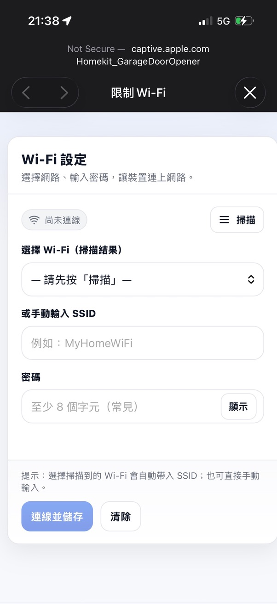
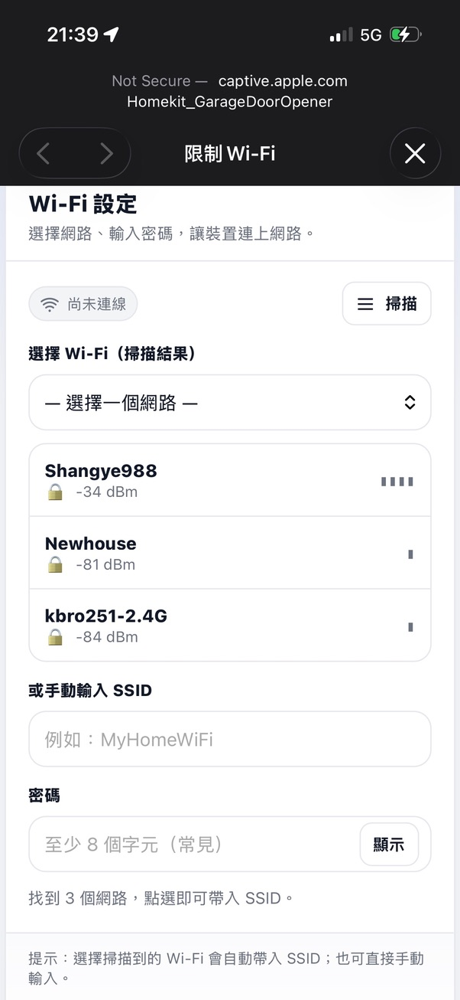

# HomeKit Garage Door Opener

ESP32-based Apple HomeKit garage door controller using ESP-IDF and FreeRTOS.

---

## Overview

This project implements a HomeKit-compatible garage door opener built on ESP32C3.

---

## Features

- Apple HomeKit accessory support
- WiFi provisioning via SoftAP
- FreeRTOS task-based architecture
- NVS-based configuration storage

---

## Build

```bash
idf.py build
idf.py flash
```
---
## WiFi Setup Page

<p align="center">
  
  
</p>